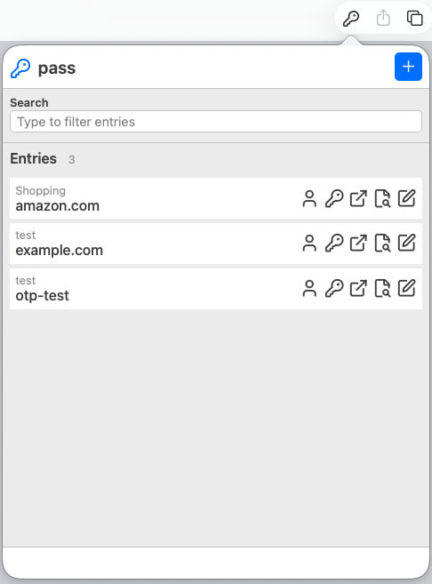
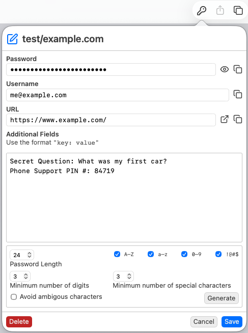
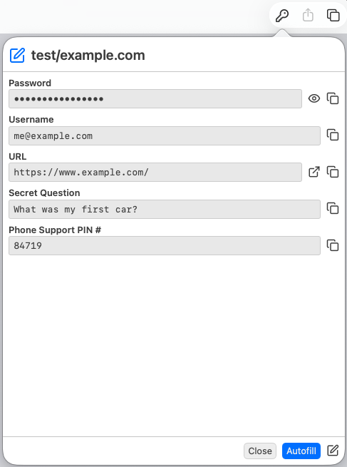
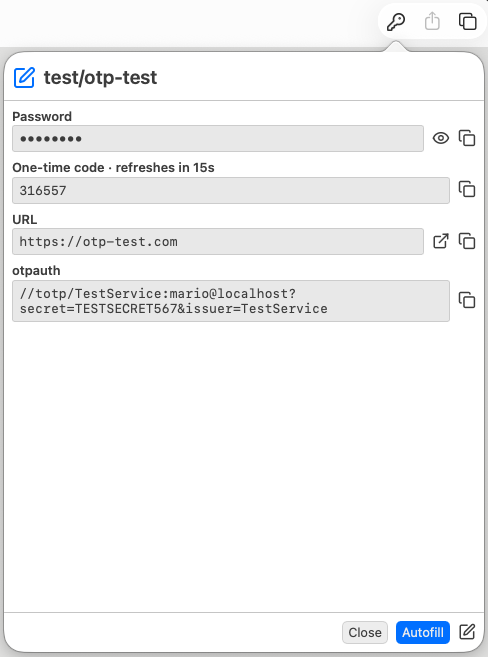
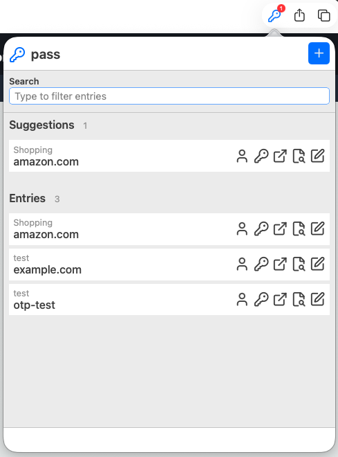

# pass-safari

A Safari extension for the [pass](https://www.passwordstore.org/) standard Unix password manager.

## Features

- Access your pass password store from Safari
- Auto-suggest passwords based on the current URL
- Support for TOTP/OTP codes
- Integrated password generator
- Secure architecture with minimal permissions
- Simple file-based communication between extension and app

## Screenshots


Password entries


Create/edit entry


Entry details


Entry details with OTP


Suggestions for the current URL


## Installation

### Requirements

- macOS 11.0 or later
- Xcode 13.0 or later (for building)
- pass password manager installed and configured
- pass-otp extension


### Building from Source

1. Clone the repository:
   ```bash
   git clone https://github.com/yourusername/pass-safari.git
   cd pass-safari
   ```

2. Open the project in Xcode:
   ```bash
   open pass-safari.xcodeproj
   ```

3. Build and run the project (⌘R)

4. Enable the extension in Safari:
   - Safari → Preferences → Extensions
   - Enable "pass-safari Extension"

## Architecture

### Simple File-Based Communication

The extension uses a simple, proven approach with files in the bundle's cache directory:

```
~/Library/Group Containers/group.de.zisoft.pass-safari/Library/Caches/pass-safari
├── PassRequest-*.plist                # Request files from extension
├── PassResponse-*.plist               # Response files from app
├── URLIndexCache.json                 # Cached URL mappings
└── URLIndexRefresh.lock               # Lock file for index refresh
```

### Why This Approach?

1. **Extension is sandboxed** - Can only access app group directory
2. **App is NOT sandboxed** - Can execute the `pass` executable without issues
3. **Works reliably** - Standard approach used by many Safari extensions

### Components

1. **Safari Extension** (`pass-safari Extension`)
   - Runs in Safari's sandboxed environment
   - Lists password entries
   - Manages UI and user interactions
   - Creates pass request files in the app group cache directory

2. **Companion App** (`pass-safari`)
   - Runs WITHOUT sandbox (needs to execute `pass`)
   - Executes pass commands
   - Generates OTP codes
   - Writes pass response files to the app group cache directory

### Communication Flow

```
Safari Extension → PassRequest-*.plist (in the app group cache directory)
                    ↓
Companion App reads request
                    ↓
Executes: pass executable to perform the required action
                    ↓
Companion App → PassResponse-*.plist (in the app group cache directory)
                    ↓
Safari Extension reads response → Displays result
```

## Usage

### First Run

1. Launch the pass-safari app

### In Safari

1. Navigate to a website
2. Click the pass-safari extension icon
3. Click on a password entry from the list
4. The password is automatically filled

### URL Matching

The extension automatically suggests passwords based on:
- Exact hostname matches
- Subdomain matches
- URL fields in password entries

For quick access, a `URLIndexCache.json` file is created in the app group container cache directory `~/Library/Group Containers/group.de.zisoft.pass-safari/Library/Caches/pass-safari`. On the first run this may take some time, so please be patient. On subsequent runs only the changed entries are used to update the cache file, which is much faster. All fields from the password entries starting with one of:

- `url`
- `website`
- `site`

are stored in the cache. So you can easily use multiple URLs in one password entry like `url:`, `url2:`, etc.


## Security

- Extension runs in macOS App Sandbox with minimal permissions
- Communication via simple files in `~/Library/Group Containers/group.de.zisoft.pass-safari/Library/Caches/pass-safari`
- No network access required
- No telemetry or tracking

## Development

### Project Structure

```
pass-safari/
├── pass-safari/                       # Companion app (NOT sandboxed)
│   ├── AppDelegate.swift              # App lifecycle & pass execution
│   ├── ViewController.swift           # UI
│   └── pass-safari.entitlements       # AppGroup
├── pass-safari Extension/             # Safari extension (sandboxed)
│   ├── SafariWebExtensionHandler.swift  # Native messaging
│   ├── pass-safari Extension.entitlements  # AppGroup, ReadOnly access to `~/.password-store`
│   └── Resources/
│       ├── popup.html                 # Extension UI
│       ├── popup.js                   # Extension logic
│       └── background.js              # Background tasks
└── pass-safari.xcodeproj/             # Xcode project
```

### Key Files

- `SafariWebExtensionHandler.swift` - Handles messages from JavaScript
- `AppDelegate.swift` - Executes pass commands
- `popup.js` - Extension UI logic and user interactions

### Entitlements

**Extension** (`pass-safari Extension.entitlements`):
- `com.apple.security.app-sandbox` - Required for Safari extensions
- `com.apple.security.files.user-selected.read-only` - Password store access
- `com.apple.security.temporary-exception.files.home-relative-path.read-only` - Read password store

**Companion App** (`pass-safari.entitlements`):
- Empty! No sandbox, so it can execute `pass` executable

## Troubleshooting

### Pass not found
The app looks for pass in:
- `/opt/homebrew/bin/pass`
- `/usr/local/bin/pass`
- `/usr/bin/pass`
- `/bin/pass`
- Or via `which pass` in your PATH

Make sure pass is installed and properly set up.

### Debug logging
Check Console.app and filter by "pass-safari" for detailed logs.

## License

MIT — see [LICENSE](LICENSE).

## Credits

- Built for [pass](https://www.passwordstore.org/) by Jason A. Donenfeld
- [Password generator](https://github.com/daniausman24-bot/password-generator) by Dania Usman 

